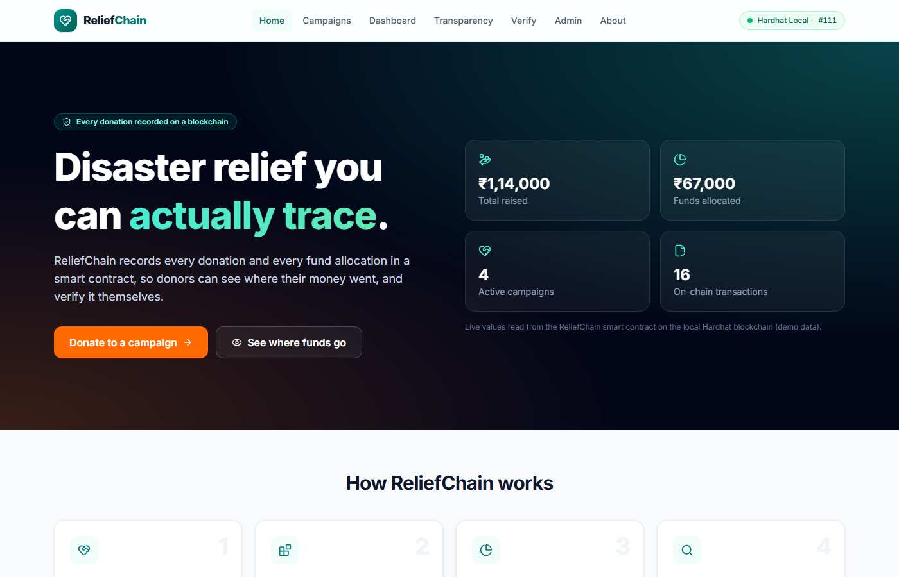
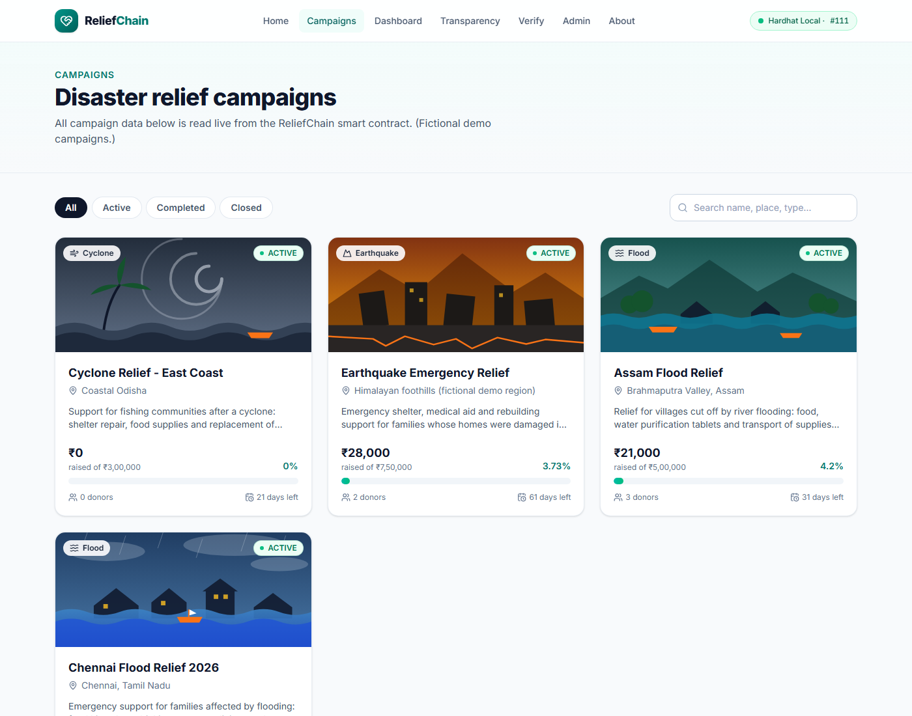
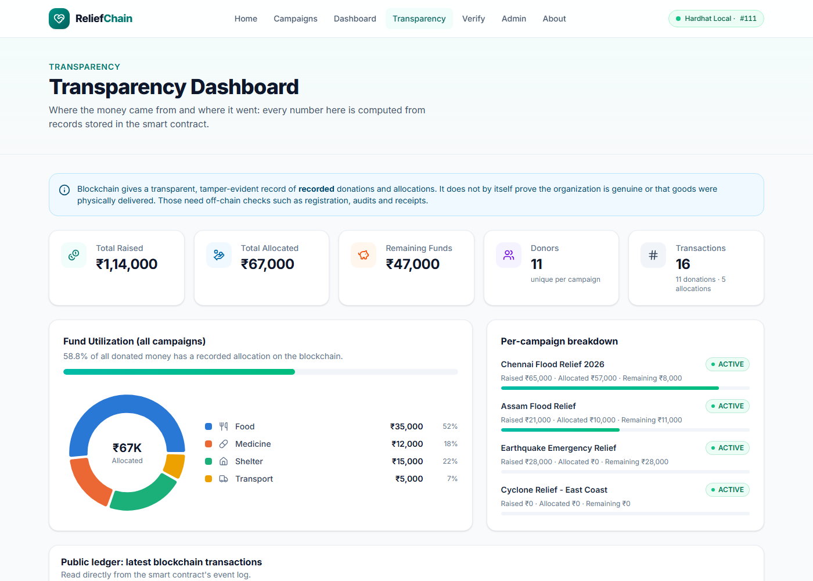
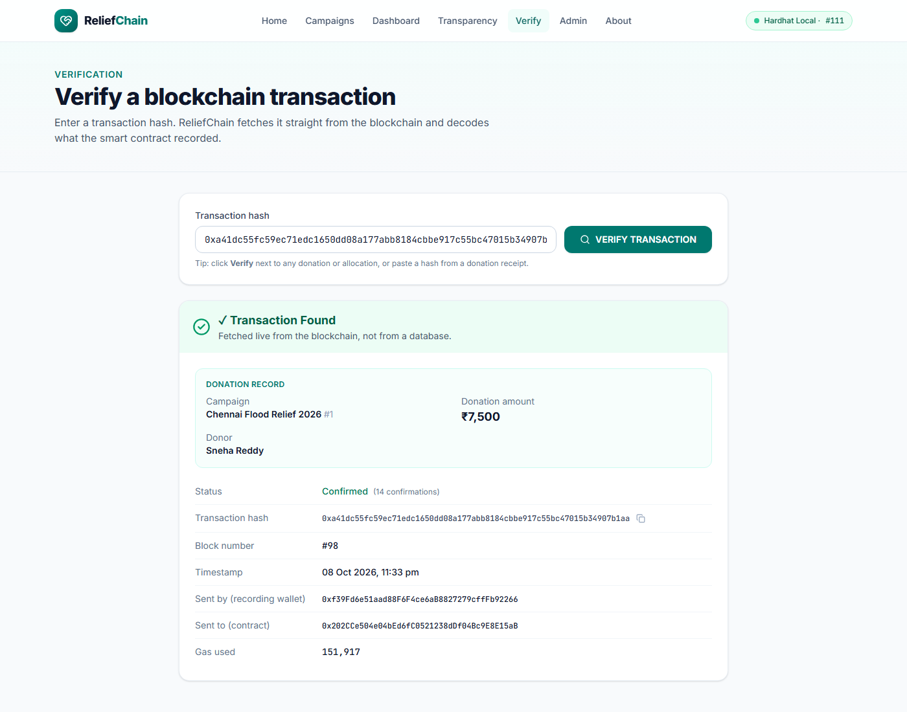
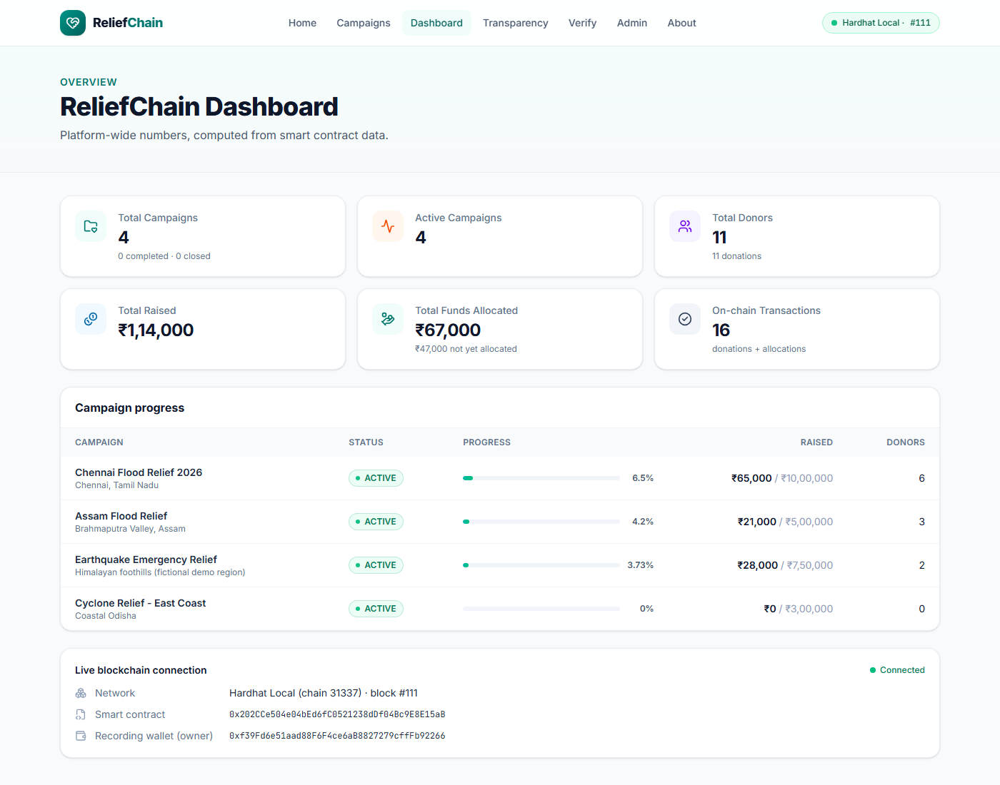
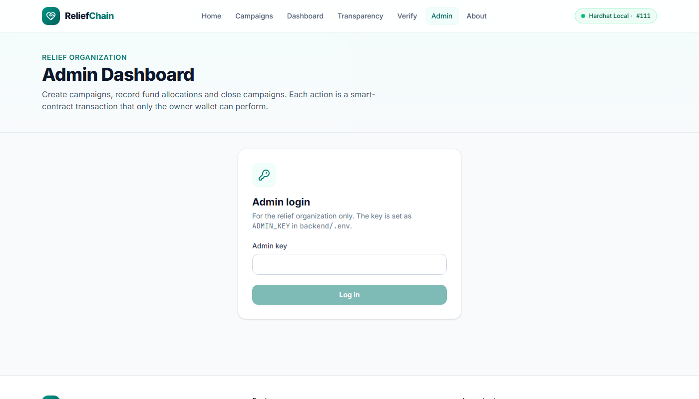

# ReliefChain: Blockchain-Based Disaster Relief Fund Tracker

> **Syllabus topic:** *Develop a Blockchain based application for transparent and genuine charity.*

ReliefChain is a web application where people donate to disaster-relief campaigns. Every donation, and every record of how the money was used (Food, Medicine, Shelter, Transport…), is written to an Ethereum **smart contract**. Anyone can see the records, and anyone can verify any transaction by its hash.

> ⚠️ **Demo project.** All campaigns, donor names and amounts are **fictional demonstration data** on a **local Hardhat blockchain**. No real money is collected or moved.

---

## 1. Problem statement

When people donate after a flood or earthquake, they usually cannot see:
- whether their donation was actually received and counted,
- how much the campaign really collected,
- how the money was spent (food? medicine? shelter?).

Records sit in the charity's private database. They can be edited, deleted or simply not published. This lack of transparency reduces trust and discourages donations.

## 2. Proposed solution

ReliefChain stores the **financial record** of a relief campaign on a blockchain:

```
Rahul donates ₹500 to Chennai Flood Relief
        ↓
React website → FastAPI backend → ReliefChain smart contract → Blockchain
        ↓
Permanent record:  Rahul → ₹500 → Chennai Flood Relief   (tx hash 0x83a7…91fd)
```

Later, when the organization uses funds, it records an **allocation** (e.g. *Food, ₹25,000, "Dry ration kits"*). The smart contract **refuses** any allocation larger than the money actually donated.

### The honest transparency principle

> **Blockchain does not automatically prove that a charity organization is genuine. It provides a transparent and tamper-evident record of donations and fund allocations.**

- Verifying that an organization is genuine (registration, audits, field reports) is an **administrative, off-chain** process.
- Blockchain makes the **recorded financial activity** public and very hard to change secretly.
- Any user can **independently verify** a transaction using its hash.

## 3. Objectives

1. Record every donation on a blockchain with a unique transaction hash.
2. Record how collected funds are allocated, by category.
3. Prevent recording allocations larger than available funds (enforced by the smart contract).
4. Show a public transparency dashboard of raised, allocated and remaining funds.
5. Let anyone verify a transaction directly from the blockchain.
6. Keep the system simple enough to explain and demonstrate in about 5 minutes.

## 4. Features

| # | Feature | Where |
|---|---|---|
| A | Home page with live numbers | `/` |
| B | Disaster relief campaigns (filter + search) | `/campaigns` |
| C | Campaign details: target, raised, remaining, progress, donors, status | `/campaigns/:id` |
| D | Live blockchain connection indicator (network, block, contract) | Navbar, Dashboard, About |
| E | Donations recorded on the blockchain (name + ₹ amount) | Campaign page |
| F | Donation history with transaction hashes | Campaign page |
| G | Fund allocation with a donut chart and category cards | Campaign page, Admin |
| H | Transparency dashboard and public ledger | `/transparency` |
| I | Blockchain transaction verification | `/verify` |
| J | Admin: create campaign, allocate funds, close campaign | `/admin` |
| | Project dashboard (campaigns, active, donors, raised, allocated) | `/dashboard` |
| | Automatic status: 🟢 ACTIVE · 🔵 COMPLETED (target reached) · 🔴 CLOSED | everywhere |

## 5. Technology stack

| Layer | Technology |
|---|---|
| Smart contract | **Solidity 0.8.24**, OpenZeppelin `Ownable` |
| Blockchain (local) | **Hardhat** network (chain id 31337) |
| Contract tests | Hardhat + Mocha/Chai (15 tests) |
| Backend | **Python FastAPI** + **web3.py** |
| Backend tests | pytest (5 integration tests against the live chain) |
| Frontend | **React 19** + **Vite** + **Tailwind CSS v4** |
| Charts / icons | Recharts, lucide-react |

## 6. Architecture

```
            DONOR                                   ADMIN (relief organization)
              │                                               │
              ▼                                               ▼
   ┌──────────────────────┐                     ┌──────────────────────────┐
   │   React website      │                     │  React Admin Dashboard   │
   │ (campaigns, donate,  │                     │  (admin key login)       │
   │  verify, dashboard)  │                     │                          │
   └──────────┬───────────┘                     └────────────┬─────────────┘
              │  HTTP/JSON (REST API)                         │
              ▼                                               ▼
   ┌──────────────────────────────────────────────────────────────────────┐
   │            FastAPI backend  (backend/main.py + blockchain.py)        │
   │  • validates input            • holds the OWNER wallet (private key) │
   │  • signs & sends transactions • reads contract data + event logs     │
   └──────────────────────────────────┬───────────────────────────────────┘
                                      │  JSON-RPC (web3.py)
                                      ▼
   ┌──────────────────────────────────────────────────────────────────────┐
   │              ReliefChain smart contract  (ReliefChain.sol)           │
   │  createCampaign · donate · allocateFunds · closeCampaign · getters   │
   │  rules: onlyOwner · valid campaign ID · amount > 0 · no over-allocate│
   └──────────────────────────────────┬───────────────────────────────────┘
                                      ▼
                    Hardhat local Ethereum blockchain (127.0.0.1:8545)
```

Short version (for the viva):

```
User → React Website → FastAPI Backend → Smart Contract → Blockchain (ReliefChain)
Admin → React Admin Panel → FastAPI Backend (admin key) → Smart Contract
```

### Why a backend instead of MetaMask?

Donors don't need a crypto wallet or any cryptocurrency. They type a **name** and a **₹ amount**, like a normal donation website. The backend owns the **relief organization's wallet**, which is the smart contract's `owner`, and sends the transaction on the donor's behalf. Because only the owner can write, **outsiders cannot insert fake donations or fake allocations**, while **everyone can read and verify** every record.

## 7. Blockchain workflow

**Donation**
1. Donor opens a campaign and enters name + amount → clicks **DONATE NOW**.
2. Frontend calls `POST /api/campaigns/{id}/donate`.
3. Backend validates the input, then calls `donate(id, name, amount)` with **`estimate_gas`** first. If a `require` would fail (e.g. campaign closed), the reason is returned and nothing is sent.
4. Backend signs the transaction with the owner key and sends it to the Hardhat node.
5. The transaction is mined into a block; the contract updates totals and emits `DonationReceived`.
6. Backend returns the **transaction hash** and **block number** → shown as the donation receipt.

**Allocation**: same flow with `allocateFunds(id, category, amount, note)`. The contract checks `amount <= raised − allocated`.

**Verification**: `GET /api/verify/{hash}` → backend calls `eth_getTransactionByHash` + `eth_getTransactionReceipt` on the blockchain, checks the transaction was sent **to the ReliefChain contract**, and decodes its events (campaign, donor, amount…). Nothing is read from a database.

**History**: donation and allocation lists come from the contract (`getDonations`, `getAllocations`). Their transaction hashes come from the contract's **event logs** (`DonationReceived`, `FundsAllocated`), matched by index.

## 8. Smart contract explanation (`contracts/ReliefChain.sol`)

**Data stored**

| Struct | Fields |
|---|---|
| `Campaign` | id, name, disasterType, location, description, imageUrl, targetAmount, raisedAmount, allocatedAmount, deadline, createdAt, creator, status, donorCount, donationCount |
| `Donation` | donorName, amount, timestamp |
| `Allocation` | category (Food/Medicine/Shelter/Transportation/Other), amount, note, timestamp |

**Functions**

| Function | Who | What it does |
|---|---|---|
| `createCampaign(...)` | owner | New campaign (status ACTIVE) |
| `donate(id, donorName, amount)` | owner (backend) | Records a donation; becomes **COMPLETED** automatically when target is reached |
| `allocateFunds(id, category, amount, note)` | owner | Records a use of funds; must not exceed available funds |
| `closeCampaign(id)` | owner | Status → CLOSED, no more donations |
| `getCampaign`, `getAllCampaigns`, `getDonations`, `getAllocations`, `getAvailableFunds` | anyone | Free read-only (`view`) functions |

**Events:** `CampaignCreated`, `DonationReceived`, `FundsAllocated`, `CampaignStatusChanged`.

**Security checks** (each explained in code comments)

| Check | Why |
|---|---|
| `onlyOwner` on all write functions (OpenZeppelin `Ownable`) | Nobody else can create fake campaigns, fake donations or fake allocations |
| `validCampaign` modifier: `id > 0 && id <= campaignCount` | No record can be attached to a non-existent campaign |
| `amount > 0`, name length 1–64 | No empty / meaningless records |
| `status == Active` and `block.timestamp <= deadline` for donations | Closed, completed or expired campaigns don't keep collecting |
| `amount <= raisedAmount − allocatedAmount` for allocations | The organization cannot claim to have spent money it never received |
| `enum Category` | Invalid categories are rejected automatically |
| Donor names hashed with `keccak256` for unique-donor counting | Fixed-size 32-byte key, cheaper than comparing strings |

## 9. Data storage design decision

No PostgreSQL, MongoDB or Firebase is used.

| Data | Stored in | Reason |
|---|---|---|
| Campaigns, targets, status | Smart contract | Must be public and tamper-evident |
| Donations, allocations | Smart contract | Core financial record |
| Transaction hashes | Blockchain event logs | Proof that each record exists |
| Campaign images | `frontend/public/images` (local files) | Large files are expensive to store on a blockchain; only a short path is stored on-chain |
| Admin key, private key | `backend/.env` | Secrets, never on-chain |

The smart contract is the **single source of truth** for all financial data.

---

## 10. Installation

**Prerequisites:** Node.js 20+ (tested on 22), npm, Python 3.10+ (tested on 3.11), Git.

```bash
# 1. Root (Hardhat + contract)
npm install

# 2. Frontend
cd frontend
npm install
cd ..

# 3. Backend (Python virtual environment)
cd backend
python -m venv .venv
.venv\Scripts\activate          # Windows
# source .venv/bin/activate     # macOS / Linux
pip install -r requirements.txt
copy .env.example .env          # Windows   (macOS/Linux: cp .env.example .env)
cd ..
```

## 11. Hardhat setup and contract deployment

Open **terminal 1** and keep it running:

```bash
npx hardhat node
```

This starts a local blockchain at `http://127.0.0.1:8545` and prints 20 test accounts. **Account #0** (`0xf39F…2266`) deploys the contract and becomes its owner. Its private key is the default in `backend/.env.example`.

Open **terminal 2**:

```bash
npx hardhat compile
npx hardhat test                                           # 15 passing
npx hardhat run scripts/deploy.js --network localhost      # deploy + demo data
```

`deploy.js` deploys the contract, writes the address + ABI to `backend/contract/ReliefChain.json`, and creates the 4 **demo campaigns** with sample donations and allocations (all real transactions).

> 🔁 **Every time you restart `npx hardhat node`, the chain is empty again. Re-run the deploy command.** The backend detects the new contract automatically.

## 12. Running the backend

**Terminal 3:**

```bash
cd backend
.venv\Scripts\activate
uvicorn main:app --reload --port 8010
```

- API docs (Swagger UI): http://127.0.0.1:8010/docs
- Health check: http://127.0.0.1:8010/api/health

## 13. Running the frontend

**Terminal 4:**

```bash
cd frontend
npm run dev
```

Open **http://localhost:5180**. Vite forwards `/api/*` to the backend on port 8010.

**Admin login:** go to *Admin* and enter the key from `backend/.env` (default `reliefchain-admin`).

### MetaMask?

Not needed. Per the project design, donors use the website without a crypto wallet, and the backend signs transactions with the organization's wallet. *(Optional exploration only:* you can still import Hardhat Account #0 into MetaMask to look at the local chain. Add a network with RPC `http://127.0.0.1:8545` and chain ID `31337`, then *Import account* → paste the private key printed by `npx hardhat node`. Never use these test keys on a real network.)

## 14. Testing

| Test | Command | Result |
|---|---|---|
| Smart contract (Hardhat) | `npx hardhat test` | **15 passing** |
| Backend ↔ blockchain integration | `cd backend && .venv\Scripts\python -m pytest -v` | **5 passed** (needs node + deploy) |
| Frontend build | `cd frontend && npm run build` | builds without errors |

Contract tests cover: deployment, campaign creation (+ invalid input), donation, multiple donations + unique donors, automatic COMPLETED status, fund allocation, **unauthorized admin actions**, **invalid campaign IDs**, **invalid / over-allocation**, campaign closing, deadline expiry.

Backend tests cover: health/ownership, donation → history → **verification of the real tx hash**, over-allocation rejection, COMPLETED/CLOSED status, missing admin key, invalid campaign, invalid input, fake/malformed hashes.

The frontend was also tested with scripted clicks in a real Chrome browser: donation form → mined transaction → receipt with hash → history updated; admin login (wrong + right key), allocation, close campaign, create campaign; error states (invalid campaign, backend offline); and a 390px phone layout check on every page.

> Integration tests write test campaigns to the local chain. Re-run `deploy.js` afterwards for clean demo data.

## 15. Hosting online (Sepolia + Render + Vercel)

The project can be hosted for free, with the contract on Ethereum's **Sepolia testnet** (every transaction visible on sepolia.etherscan.io), the backend on **Render** and the website on **Vercel**. Follow the step-by-step guide in **[HOSTING.md](HOSTING.md)**.

## 16. Screenshots

Captured from the running app (demo data). Add a *Donation Successful* screenshot and the `npx hardhat test` output yourself before submission.

| Home | Campaigns |
|---|---|
|  |  |

| Campaign details + fund allocation | Transparency dashboard |
|---|---|
|  |  |

| Transaction verification | Dashboard |
|---|---|
|  |  |

| Admin login |
|---|
|  |

## 17. Limitations

- **Trust in the backend:** donors don't sign transactions themselves, so the backend (organization) decides what gets recorded. A record can't be secretly changed *after* it is written, but a dishonest organization could simply not record something.
- **No real payment:** ₹ amounts are recorded, not transferred. A real system would connect a payment gateway (UPI/card) and record the gateway's payment ID on-chain.
- **Allocation is self-reported:** the contract proves *what the organization claimed* and *when*, not that goods physically reached victims.
- **Unique donors are counted by name**, so two different people named "Rahul" count as one, and all "Anonymous" donors count as one.
- **Donor names are public** on the blockchain (use "Anonymous" for privacy).
- **Local chain only:** restarting `npx hardhat node` erases all data (re-run deploy).
- Single admin key, no user accounts (intentionally simple).

## 18. Future scope

- Payment gateway integration (UPI) with the payment reference stored on-chain.
- Let donors who own a wallet donate directly with MetaMask (donor-signed transactions).
- Upload bills/receipts to **IPFS** and store their hash with each allocation.
- Multi-signature approval for allocations (e.g. 2 of 3 trustees must approve).
- Verified beneficiary/vendor wallets and direct payments to them.
- Deploy to a public testnet / low-fee network (Polygon) with a block-explorer link.
- Email/SMS receipt containing the transaction hash.

## 19. Viva questions

See **[VIVA.md](VIVA.md)** for 18+ questions with simple answers.

## 20. Demo steps (≈5 minutes)

Before the viva: start the node, deploy, start backend and frontend (sections 11–13).

1. Open **http://localhost:5180**: show the hero numbers (live from the contract) and the green *Hardhat Local · #block* pill.
2. **Campaigns** → open **Chennai Flood Relief 2026**.
3. Show target, raised, progress, donors, status and the fund allocation donut.
4. Enter name **Rahul**, amount **₹500** → **DONATE NOW**.
5. Show **Donation Successful ✓** with the **transaction hash** and **block number**.
6. Scroll to **Donation History**: Rahul is at the top with the same hash. Raised went up by ₹500.
7. **Admin** → log in → **Allocate Funds** → Chennai → *Medicine* ₹500 "ORS packets" → submit. Then try an amount larger than *available* to show it is rejected.
8. Back on the campaign page: the allocation appears in the chart and the records list.
9. **Transparency**: totals, utilization, category donut, public ledger.
10. **Verify**: click *Verify* next to Rahul's donation → *✓ Transaction Found*, campaign, ₹500, donor, block, status Confirmed. Try a fake hash → *not found*.
11. Close with the transparency principle: *the blockchain gives a transparent, tamper-evident record; organization verification is an off-chain process.*

Also see **[DEMO_SCRIPT.md](DEMO_SCRIPT.md)** and **[PRESENTATION.md](PRESENTATION.md)**.

---

## Project structure

```
ReliefChain/
├── contracts/ReliefChain.sol        # Solidity smart contract
├── scripts/deploy.js                # deploy + seed demo data, writes backend/contract/ReliefChain.json
├── test/ReliefChain.test.js         # 15 Hardhat tests
├── hardhat.config.js
├── package.json                     # Hardhat project
├── backend/
│   ├── main.py                      # FastAPI routes + validation + admin key
│   ├── blockchain.py                # web3.py: send transactions, read data/events, verify
│   ├── test_api.py                  # pytest integration tests
│   ├── requirements.txt
│   ├── .env.example                 # RPC_URL, PRIVATE_KEY (Hardhat test key), ADMIN_KEY
│   └── contract/ReliefChain.json    # generated by deploy.js (address + ABI)
├── frontend/
│   ├── public/images/               # local campaign cover images (not on-chain)
│   └── src/
│       ├── components/              # Navbar, CampaignCard, DonationForm, DonationHistory,
│       │                            # FundAllocation, AllocationChart, TransparencyDashboard,
│       │                            # TransactionVerification, AdminPanel, BlockchainStatus,
│       │                            # ProgressBar, StatsCard, StatusBadge, TxHash, Footer …
│       ├── pages/                   # Home, Campaigns, CampaignPage, Dashboard, Transparency,
│       │                            # Verify, Admin, About
│       ├── utils/                   # api.js, format.js, constants.js, useApi.js, useChainHealth.js
│       └── App.jsx
├── README.md · VIVA.md · PRESENTATION.md · DEMO_SCRIPT.md
```

## Ports used

| Service | Port |
|---|---|
| Hardhat node | 8545 |
| FastAPI backend | 8010 |
| React frontend | 5180 |
